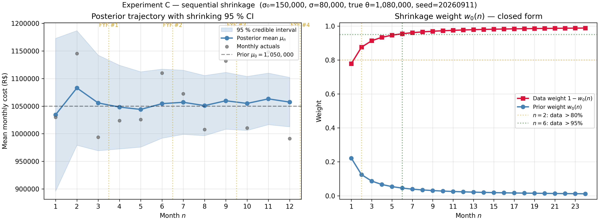
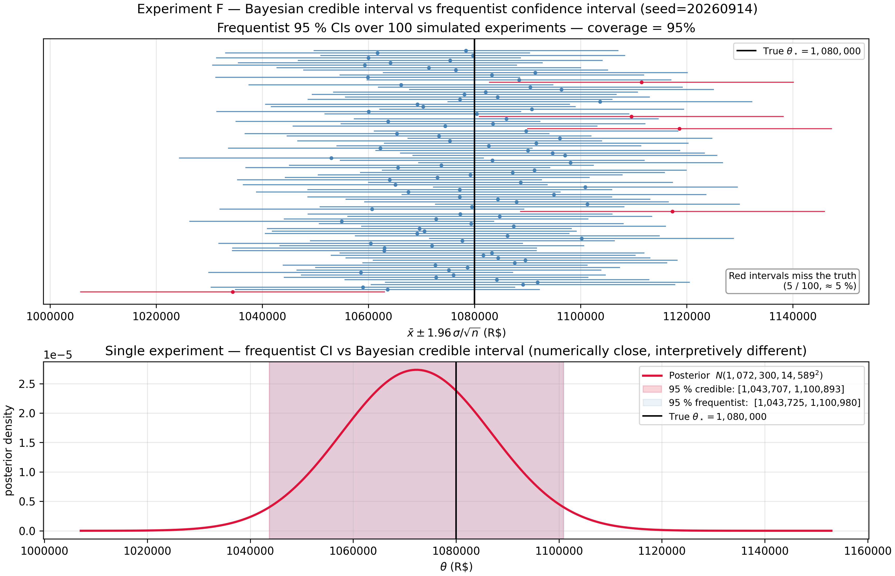
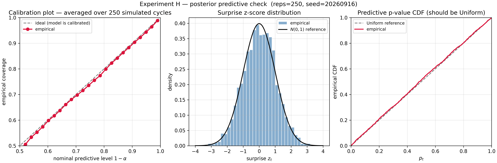

# O Orçamento que Aprende

**Previsão Bayesiana para Revisões Periódicas de Orçamento — de Crenças A Priori à Certeza A Posteriori**

> *Uma previsão orçamentária que ignora seu próprio histórico é um
> estimador sem memória — descarta a informação acumulada nas
> revisões anteriores e nos realizados observados. A atualização
> Bayesiana fornece a forma matematicamente ótima de combinar
> crenças a priori (o orçamento original) com evidência incoming
> (realizados mensais): a previsão a posteriori é sempre pelo menos
> tão boa quanto a a priori, afina monotonicamente conforme os dados
> chegam e equilibra automaticamente a confiança no plano contra a
> confiança nos dados via a média ponderada por precisão. **Cada
> ciclo de FYF não é uma nova previsão — é uma atualização Bayesiana.***

---

## 1. Introdução: A Previsão que Aprende

Todo analista de orçamento vive o mesmo calendário. Dezembro: um
plano é aprovado. Abril, julho, outubro, janeiro do ano seguinte:
uma revisão Forecast Year-end Financial (FYF) ajusta o plano contra
os realizados acumulados no ano. As revisões são trimestrais; as
perguntas, perenes. *Em quanto devo mover a previsão? Quão apertada
está minha nova estimativa? Qual a chance de estourar o teto
orçamentário até o fim do ano?*

A resposta tradicional trata cada revisão como uma estimativa nova.
O analista olha para os realizados acumulados, mentalmente os pesa
contra o plano e produz um número novo. O número novo é então
defendido em reunião; a defesa é geralmente qualitativa; o peso
escolhido raramente é auditável.

Este artigo argumenta que o ciclo FYF é, em sentido matemático
preciso, **atualização Bayesiana sequencial**. O plano é uma
*priori*. Os realizados são *dados*. A previsão revisada é uma
*posteriori*. Não é analogia; é identidade. E reconhecer essa
identidade transforma três dores qualitativas em resultados em
forma fechada:

1. *Como ponderar o plano contra os dados?* — Pela **média
 ponderada por precisão** da posteriori Normal–Normal. Os pesos
 não são questão de julgamento: são funções da incerteza a priori
 declarada e do ruído de observação por mês.
2. *Quão apertada está minha previsão?* — A variância a posteriori
 encolhe monotonicamente a cada novo mês. A Seção 4 tornará esse
 "monotonicamente" rigoroso e quantitativo.
3. *Qual a probabilidade de fechar o ano acima do orçamento?* — A
 distribuição **preditiva a posteriori** aplicada aos meses não
 observados dá uma forma fechada exata, não uma heurística.

O caminho da afirmação à demonstração é curto. A Seção 2 deriva o
teorema de Bayes para parâmetros contínuos e esclarece a diferença
entre intervalos credíveis e intervalos de confiança. A Seção 3
desenvolve os quatro pares conjugados a priori–verossimilhança que
cobrem o modelo de custo FYF. A Seção 4 encadeia atualizações
conjugadas ao longo do ano e prova que a atualização sequencial e a
em lote produzem posterioris idênticas. A Seção 5 sobrepõe a
preditiva a posteriori — o que o CFO de fato quer. A Seção 6 conecta
toda a maquinaria a um ciclo anual completo de um orçamento de
headcount de TI com 50 pessoas. A Seção 7 roda os experimentos. A
Seção 8 fornece o diagnóstico que decide quando o modelo deve ser
acreditado e quando sua resposta mecânica é enganosa. As Seções 9–11
conectam à série e fecham.

### Escopo e antiescopo

O artigo cobre o teorema de Bayes para parâmetros contínuos; os
quatro pares conjugados (Normal–Normal, Normal–Inversa-Gama,
Gama–Poisson, Beta–Binomial); atualização sequencial e a assintótica
do encolhimento (shrinkage); distribuições preditivas a posteriori e
o total de fim de ano; sensibilidade ao prior; checagem de modelo
via posterior predictive checks. Deliberadamente **não** cobre
MCMC, modelos hierárquicos, métodos não paramétricos, inferência
variacional ou dados reais de empresa. A contribuição do artigo é
que **atualização Bayesiana em forma fechada é suficiente** para
explicar e melhorar o ciclo FYF.

### O que o leitor precisa saber

Uma base sólida de graduação: integração por substituição,
completar o quadrado, as distribuições Normal/LogNormal/Poisson, a
lei da variância total. Teorema de Bayes na forma discreta. Todo
resultado contínuo é derivado destes em detalhe.

---

## 2. Teorema de Bayes para Analistas de Orçamento

Sejam $X$ os dados observados e $\theta$ um parâmetro desconhecido,
ambos tratados como variáveis aleatórias. A **regra do produto para
densidades** fatora a densidade conjunta de duas formas:

$$
f(x, \theta) = f(x \mid \theta) \pi(\theta) = \pi(\theta \mid x) f(x).
$$

Igualando e resolvendo para o segundo fator obtemos o **teorema de
Bayes para parâmetros contínuos**:

$$
\boxed{\quad
\pi(\theta \mid x) = \frac{f(x \mid \theta) \pi(\theta)}{f(x)},
\qquad
f(x) = \int f(x \mid \theta) \pi(\theta) \mathrm d\theta.
\quad}
$$

Os quatro objetos têm nome. $\pi(\theta)$ é a **priori**; em FYF, o
plano de orçamento expresso como distribuição. $f(x \mid \theta)$ é
a **densidade amostral**; vista como função de $\theta$ para $x$
fixo, é a **verossimilhança**. $f(x)$ é a **verossimilhança
marginal** ou evidência — a probabilidade dos dados, em média sobre
a priori. $\pi(\theta \mid x)$ é a **posteriori**: a previsão
revisada.

Como $f(x)$ não envolve $\theta$, a forma proporcional
$\pi(\theta \mid x) \propto f(x \mid \theta) \pi(\theta)$ basta na
prática. Em famílias conjugadas (§3) reconhecemos o núcleo da
direita como o de uma distribuição conhecida e leitamos os
hiperparâmetros direto; a verossimilhança marginal está implícita
na família e nunca precisa ser integrada.

### Resumos pontuais

Quando um número é necessário:

- **Máxima a posteriori (MAP)**: $\hat\theta_{\text{MAP}} = \arg\max_\theta \pi(\theta \mid x)$.
- **Média a posteriori**: $\hat\theta_{\text{PM}} = \mathbb E[\theta \mid x]$.
- **Mediana a posteriori**.

Para posterioris simétricas e unimodais (toda posteriori Normal
neste artigo) os três coincidem. Para uma priori uniforme, o MAP
iguala o estimador de máxima verossimilhança: uma priori plana
produz a estimativa pontual clássica, mas com interpretação por
intervalo credível que continua diferindo de um intervalo de
confiança — vide abaixo.

### Intervalos credíveis vs intervalos de confiança

Um **intervalo credível $100(1-\alpha)\%$** para $\theta$ é qualquer
subconjunto $C$ com $\Pr(\theta \in C \mid x) = 1 - \alpha$. A
escolha mais usada é o intervalo de caudas iguais limitado pelos
quantis a posteriori $\alpha/2$ e $1 - \alpha/2$.

O contraste com o intervalo de confiança frequentista é a
articulação conceitual do artigo. O intervalo credível faz uma
afirmação probabilística direta *sobre $\theta$* dado o dado
realizado: "dado o que vi, há 95 % de chance de o parâmetro estar
em $[a, b]$". O intervalo frequentista faz uma afirmação *sobre o
procedimento*: 95 % dos intervalos construídos por essa regra,
sobre repetições hipotéticas do experimento, conteriam o $\theta$
verdadeiro. Após observar um dataset específico, o intervalo
frequentista contém ou não $\theta$ — não há afirmação
probabilística sobre *aquele* intervalo. Os dois podem coincidir
numericamente em casos simples, mas suas interpretações diferem.

Para um comitê de orçamento perguntando "vamos exceder R\$ 13,2 M?"
a afirmação relevante é sobre o parâmetro (ou sobre a previsão), não
sobre o procedimento. O intervalo credível é o objeto operacional.

### Elicitação a priori: o plano de orçamento É uma priori

A objeção clássica — "mas a priori é subjetiva" — perde o ponto. O
plano de orçamento sempre foi subjetivo. O framework Bayesiano só
torna a subjetividade explícita e atualizável. Um planejador que
declara "esperamos custo mensal $\mu_0$ com $\gamma$-confiança de
que a verdade está dentro de $\pm w$" está implicitamente
especificando uma priori Normal $N(\mu_0, \sigma_0^2)$ com

$$
\sigma_0 = \frac{w}{z_{(1+\gamma)/2}},
$$

em que $z_q$ é o quantil Normal padrão. O cenário de referência do
artigo usa $\mu_0$ = R\$ 1.050.000,
$\sigma_0$ = R\$ 150.000 — um plano de orçamento e uma
incerteza declarada, traduzidos em priori em uma linha.

---

## 3. Famílias Conjugadas: Atualização em Forma Fechada

Uma família $\mathcal F$ de prioris é **conjugada** a um modelo
amostral se a posteriori obtida pelo teorema de Bayes permanece em
$\mathcal F$. Os hiperparâmetros se atualizam por uma regra
explícita; a verossimilhança marginal está implícita; a atualização
sequencial vira soma (§4). Os quatro pares desta seção cobrem todo
componente do modelo de custo FYF.

### 3.1 Normal–Normal (variância conhecida) — a âncora do artigo

Seja $\theta$ a média desconhecida de um modelo amostral Normal com
variância $\sigma^2$ **conhecida**:

$$
x_1, \ldots, x_n \mid \theta \overset{\text{iid}}{\sim} N(\theta, \sigma^2),
\qquad
\theta \sim N(\mu_0, \sigma_0^2).
$$

A verossimilhança, vista como função de $\theta$ e após expandir
$\sum (x_i - \theta)^2 = \sum (x_i - \bar x)^2 + n(\bar x - \theta)^2$,
é proporcional a $\exp\big(-\tfrac{n}{2\sigma^2}(\theta - \bar x)^2\big)$.
Multiplicando pela priori, agrupando por potências de $\theta$ e
completando o quadrado obtemos um núcleo Normal com

$$
\boxed{\quad
\theta \mid x_{1:n} \sim N(\mu_n, \sigma_n^2),
\qquad
\tau_n = \tau_0 + n\tau,
\qquad
\mu_n = \frac{\tau_0\mu_0 + n\tau\bar x}{\tau_n},
\quad}
$$

em que $\tau \equiv 1/\sigma^2$ e $\tau_0 \equiv 1/\sigma_0^2$ são
as **precisões** (inversos das variâncias). De forma equivalente,
em variâncias,

$$
\mu_n = \frac{\sigma^2 \mu_0 + n \sigma_0^2 \bar x}{\sigma^2 + n \sigma_0^2},
\qquad
\sigma_n^2 = \frac{\sigma^2 \sigma_0^2}{\sigma^2 + n \sigma_0^2}.
$$

Essa identidade admite três leituras equivalentes.

**Aditividade da precisão.** $\tau_n = \tau_0 + n\tau$. Cada nova
observação adiciona exatamente $\tau$ unidades de precisão,
independentemente de seu valor.

**Média ponderada de médias.** Com $w_0 \equiv \tau_0 / (\tau_0 + n\tau)$
e $w_d \equiv 1 - w_0$, $\mu_n = w_0\mu_0 + w_d \bar x$. Os pesos
são proporcionais ao *conteúdo de informação* de cada fonte —
informação a priori $\tau_0$, informação dos dados $n\tau$.

**Encolhimento em direção à priori.** Equivalentemente,
$\mu_n = \bar x + w_0(\mu_0 - \bar x)$: a média dos dados é encolhida
em direção à média a priori por um fator $w_0$.

### 3.2 Normal–Inversa-Gama (variância desconhecida)

Quando $\sigma^2$ também é desconhecida, a priori conjugada é a
**Normal–Inversa-Gama**:
$\sigma^2 \sim \text{Inversa-Gama}(\alpha_0, \beta_0)$,
$\theta \mid \sigma^2 \sim N(\mu_0, \sigma^2/\kappa_0)$. O mesmo
argumento de "completar o quadrado" dá as quatro atualizações

$$
\mu_n = \frac{\kappa_0 \mu_0 + n\bar x}{\kappa_0 + n},
\quad
\kappa_n = \kappa_0 + n,
\quad
\alpha_n = \alpha_0 + \frac{n}{2},
$$

$$
\beta_n = \beta_0 + \tfrac{1}{2} S + \tfrac{1}{2} \frac{\kappa_0 n}{\kappa_0 + n} (\bar x - \mu_0)^2,
\quad S = \sum_{i=1}^n (x_i - \bar x)^2.
$$

A posteriori marginal de $\theta$ é uma Student-$t$ com $2\alpha_n$
graus de liberdade; a marginal de $\sigma^2$ é
Inversa-Gama$(\alpha_n, \beta_n)$. Quando $n \to \infty$ a posteriori
concentra em $(\bar x, S/n) \to (\theta_\star, \sigma_\star^2)$.

### 3.3 Gama–Poisson — atualizando taxas de eventos

Para contagens mensais de incidentes modeladas como
$x_i \mid \lambda \sim \text{Poisson}(\lambda)$ com priori
$\lambda \sim \text{Gama}(\alpha_0, \beta_0)$ (parametrização por
taxa), a posteriori é

$$
\boxed{\quad
\lambda \mid x_{1:n} \sim \text{Gama}\Big(\alpha_0 + \textstyle\sum_i x_i, \beta_0 + n\Big).
\quad}
$$

A interpretação é **pseudo-observações**: $\alpha_0$ atua como
"contagem prévia de eventos", $\beta_0$ como "período de
pseudo-observação prévio". Eventos reais e períodos reais
simplesmente somam.

### 3.4 Beta–Binomial — atualizando proporções

Para uma proporção de horas-extra $p$ com priori
$\text{Beta}(\alpha_0, \beta_0)$ e observação $x \mid p \sim \text{Binomial}(n, p)$,

$$
\boxed{\quad
p \mid x \sim \text{Beta}(\alpha_0 + x, \beta_0 + n - x).
\quad}
$$

O padrão se repete: $\alpha_0$ são sucessos a priori, $\beta_0$
falhas a priori, dados reais somam.

### 3.5 O padrão

Os quatro pares compartilham o mesmo formato: a priori contribui
uma amostra "imaginária" finita, os dados contribuem uma amostra
real, e os totais somam. Esse é o conteúdo intuitivo da conjugação
— e a base algébrica de tudo o que segue.

---

## 4. Atualização Sequencial e Encolhimento

### 4.1 Sequencial = lote

O ciclo FYF alimenta os dados **um mês por vez**. O resultado coincide
com o que o analista obteria esperando até dezembro e computando
uma posteriori em lote única?

**Teorema (sequencial = lote).** Sob independência condicional,
aplicar a regra de atualização conjugada uma vez por observação
(usando a posteriori anterior como nova priori) produz os **mesmos**
hiperparâmetros que aplicar a regra em lote a todos os dados.

Para Normal–Normal a prova é direta: $\tau_n = \tau_0 + n\tau$ é
linear em $n$ e acumula o mesmo $\tau$ independentemente da ordem
das operações; a atualização da média
$\mu_n = (\tau_0\mu_0 + n\tau\bar x)/\tau_n$ é a mesma soma
telescópica nos dois casos. Para famílias exponenciais gerais o mapa
de hiperparâmetros conjugado é *aditivo* em $n$ e na estatística
suficiente $\sum_i T(x_i)$; assim os incrementos cumulativos após $n$
passos sequenciais igualam os incrementos em lote.

O teorema diz que o ciclo FYF **não** é uma heurística. Um analista
que salva a posteriori anterior e aplica a regra conjugada mês a mês
terá, ao fim do ano, exatamente a posteriori que teria obtido se
tivesse esperado e feito uma atualização única.

### 4.2 A fórmula do encolhimento e três consequências

A média a posteriori Normal–Normal é a combinação convexa

$$
\mu_n = w_0(n) \mu_0 + (1 - w_0(n)) \bar x_n,
\qquad
w_0(n) = \frac{\tau_0}{\tau_0 + n\tau} = \frac{\sigma^2/\sigma_0^2}{\sigma^2/\sigma_0^2 + n}.
$$

Três consequências seguem imediatamente:

- **O peso de encolhimento decai como $1/n$**.
 $w_0(n) = \Theta(1/n)$, com constante líder $\sigma^2/\sigma_0^2$.
- **A variância a posteriori também decai como $1/n$**.
 $\sigma_n^2 = 1/(\tau_0 + n\tau) \sim \sigma^2/n$, batendo
 assintoticamente com a variância amostral frequentista de $\bar X_n$.
- **A média a posteriori converge para a média dos dados**.
 $\mu_n - \bar x_n = w_0(n)(\mu_0 - \bar x_n) \to 0$.

A forma recursiva (**ganho de Kalman**)

$$
\mu_n = \mu_{n-1} + K_n(x_n - \mu_{n-1}),
\qquad
K_n = \frac{\sigma_{n-1}^2}{\sigma_{n-1}^2 + \sigma^2}
$$

faz a atualização parecer processamento de sinais: a "inovação"
$x_n - \mu_{n-1}$ é a surpresa, e $K_n$ escala quanto dela a
posteriori absorve. Esse é o filtro de Kalman discreto para um
parâmetro estático.

### 4.3 Leitura FYF: quando os dados dominam?

Com parâmetros de referência $\sigma_0 = 150.000$,
$\sigma = 80.000$, a razão $\sigma^2/\sigma_0^2 \approx 0{,}2844$:

| Mês $n$ | $w_0(n)$ | $1 - w_0(n)$ |
|--------:|---------:|-------------:|
| 1 | 0,2215 | 0,7785 |
| 3 | 0,0866 | 0,9134 |
| 6 | 0,0453 | 0,9547 |
| 12 | 0,0232 | 0,9768 |

A participação dos dados cruza **80 % em $n = 2$** (já em fevereiro
com revisões mensais), **95 % em $n = 6$** (FYF de meio de ano). Na
posteriori de fim de ano, o plano de orçamento responde por ≈ 2,3 %
da resposta.

### 4.4 Sensibilidade ao prior

Dois analistas com o mesmo $\sigma_0$ mas médias a priori diferentes
$\mu_0^{(A)} \ne \mu_0^{(B)}$ produzem posterioris cuja discordância
encolhe exatamente em $w_0(n)$:

$$
\big|\mu_n^{(A)} - \mu_n^{(B)}\big| = w_0(n) \cdot \big|\mu_0^{(A)} - \mu_0^{(B)}\big|.
$$

No mês 6, uma diferença inicial de R\$ 150.000 encolheu a ≈ R\$ 6.780.
No fim de ano, a ≈ R\$ 3.460. Os dados forçam consenso.

### 4.5 Conflito priori–dados

Defina a discrepância $D_n = |\mu_0 - \bar x_n|/\sigma_0$. Quando
$D_n \gg 3$ — os dados estão "longe" da priori, em unidades de
priori — a atualização conjugada continua produzindo um número, mas
esse número é mecânico e não significativo. O modelo assumiu que a
priori foi corretamente elicitada e o modelo amostral está bem
especificado; se algum dos dois falha, a posteriori interpola entre
duas fontes erradas.

Operacionalmente: em qualquer FYF, se $D_n > 3$, *pare e
diagnostique*. Ou re-elicite a priori, ou troque o modelo amostral
(comumente: o mundo mudou — re-org, troca de fornecedor, choque
estrutural). A máquina Bayesiana responde; o analista assume a
interpretação.

---

## 5. Preditiva A Posteriori: Previsão, Não Estimação

A posteriori $\pi(\theta \mid x)$ é meio; a **preditiva a posteriori**
$p(\tilde x \mid x)$ é o fim. A preditiva é o que o negócio quer:
não "qual o custo médio?" mas "quanto custará o próximo mês? quanto
custará o total do ano?".

### 5.1 Definição e decomposição

$$
\boxed{\quad
p(\tilde x \mid x) = \int f(\tilde x \mid \theta) \pi(\theta \mid x) \mathrm d\theta.
\quad}
$$

A variância preditiva se decompõe pela **lei da variância total**:

$$
\mathrm{Var}(\tilde x \mid x)
 = 
\underbrace{\mathbb E\big[\mathrm{Var}(\tilde x \mid \theta) \mid x\big]}_{\text{ruído amostral esperado}}
 + 
\underbrace{\mathrm{Var}\big(\mathbb E[\tilde x \mid \theta] \mid x\big)}_{\text{incerteza do parâmetro}}.
$$

O primeiro termo é **ruído irredutível**. O segundo encolhe com mais
dados. Um intervalo preditivo é, portanto, sempre **mais largo** que
o intervalo credível de $\theta$, e a diferença converge
assintoticamente a $\pm 1{,}96\sigma$ — nunca a zero. Essa é a razão
formal pela qual intervalos credíveis sobre o parâmetro sozinhos
subestimam a incerteza sobre observações futuras.

### 5.2 Formas fechadas

Para os três pares operacionalmente usados pelo artigo:

- **Normal–Normal**: $\tilde x \mid x \sim N(\mu_n, \sigma_n^2 + \sigma^2)$.
- **Gama–Poisson**: $\tilde x \mid x \sim \text{NegBin}(\alpha_n, \beta_n/(\beta_n+1))$,
 parametrização forma–sucesso. Média preditiva $\alpha_n/\beta_n$,
 variância $\alpha_n(\beta_n+1)/\beta_n^2 > \alpha_n/\beta_n$ —
 **superdispersão** induzida pela incerteza do parâmetro.
- **Beta–Binomial**: lote futuro de tamanho $m$ tem PMF preditiva
 $\Pr(\tilde x = k) = \binom{m}{k} B(\alpha_n + k, \beta_n + m - k)/B(\alpha_n, \beta_n)$.

### 5.3 O total de fim de ano — cuidado com a independência

Após observar $m$ meses com cumulativo $S_m$, o total restante
$\tilde S = \sum_{t=m+1}^{12} \tilde x_t$ **não** é a soma de
preditivas iid. Os meses futuros compartilham o $\theta$ desconhecido
e estão portanto correlacionados sob a posteriori.

Escrevendo $\tilde x_t = \theta + \varepsilon_t$ com $\varepsilon_t$
iid $N(0, \sigma^2)$ independentes de $\theta$, a soma é
$(12 - m)\theta + \sum \varepsilon_t$. Os dois termos são
independentes dados $x_{1:m}$; suas variâncias somam:

$$
\boxed{\quad
\tilde S \mid x_{1:m} \sim N\big((12-m) \mu_m, (12-m)^2 \sigma_m^2 + (12-m) \sigma^2\big).
\quad}
$$

O termo de incerteza do parâmetro é **quadrático** no horizonte
$(12-m)$, não linear. A fórmula ingênua "meses futuros iid"
$(12-m)(\sigma_m^2 + \sigma^2)$ subestima a variância por um fator
$(12-m)$ na parcela do parâmetro. Em meses iniciais o horizonte é
longo e a subestimação ingênua é grande.

O total anual é $T = S_m + \tilde S$, uma Normal com média
$S_m + (12-m)\mu_m$ e a variância acima. Então

$$
P(T > B \mid x_{1:m})
 = 
1 - \Phi\Big(\frac{B - (S_m + (12-m)\mu_m)}{\sqrt{(12-m)^2 \sigma_m^2 + (12-m)\sigma^2}}\Big).
$$

Para o cenário de referência em meio de ano com
$\mu_6$ = R\$ 1.085.000, $\sigma_6$ = R\$ 32.000,
$S_6$ = R\$ 6.510.000, $B$ = R\$ 13.200.000:
$P(T > B) \approx 26\%$ pela fórmula correta, vs ≈ 20 % pelo cálculo
ingênuo. **A dependência entre meses futuros não é erro de
arredondamento.**

### 5.4 Conexão com o Artigo 1 — Monte Carlo preditivo

As formas fechadas são convenientes, mas a receita Monte Carlo
funciona em qualquer cenário:

1. Sortear $\theta^{(s)} \sim \pi(\theta \mid x)$.
2. Sortear $\tilde x^{(s)} \sim f( \cdot \mid \theta^{(s)})$.

É exatamente a estratégia do Artigo 1 aplicada à posteriori. Crucial:
para somas multi-período **reusar o mesmo $\theta^{(s)}$ em todos os
meses futuros de uma replicação** — é isso que preserva a correlação
que produz o termo quadrático na variância.

### 5.5 Fatores de Bayes (breve)

Para dois modelos concorrentes $M_1, M_2$ o **fator de Bayes** é
$BF_{12} = p(x \mid M_1)/p(x \mid M_2)$, a razão das verossimilhanças
marginais. Combinado com probabilidades de modelo a priori, dá as
chances de modelo a posteriori. Pela escala de Jeffreys,
$\log_{10} BF \in [1, 1{,}5]$ é "forte", $> 2$ é "decisivo". Em
amostras grandes $\log BF \approx -\tfrac{1}{2}(\Delta\text{BIC})$,
ligando o fator de Bayes ao BIC e (aproximadamente) ao AIC. Usamos
o fator de Bayes como comparador conceitualmente mais limpo ao
AIC/BIC do Artigo 2; não como ferramenta primária de inferência do
artigo.

---

## 6. O Modelo FYF: Um Ciclo Anual Completo

### 6.1 A decomposição de custo

O custo mensal se decompõe em três componentes — salários mais
benefícios, horas-extra e incidentes:

$$
X_t = \underbrace{n_t \cdot \bar S_t \cdot \beta}_{\text{salário + benefícios}}
 + \underbrace{C_{\text{ot},t}}_{\text{horas-extra}}
 + \underbrace{C_{\text{inc},t}}_{\text{incidentes}}.
$$

Para a camada central de inferência do artigo, $\theta$ é o **custo
médio mensal** com $X_t \mid \theta \sim N(\theta, \sigma^2)$ e
$\sigma$ conhecido. As prioris Gama–Poisson para contagem de
incidentes e Beta–Binomial para proporção de horas-extra
desenvolvidas em §3 cobrem os outros dois componentes e encaixam na
mesma máquina; mantemos os cenários canônicos desta seção em um
único componente para isolar a mecânica Bayesiana.

### 6.2 O calendário de revisões

| Mês | Evento | Análogo Bayesiano |
|---------------------|---------------------------------|-----------------------------------------|
| Dezembro (ano N−1) | Plano de orçamento aprovado | Priori $\pi(\theta)$ |
| Jan–Mar | Realizados Q1 chegam | Verossimilhança $L(\theta\mid x_{1:3})$ |
| **Abril** | **FYF #1 (revisão Q1)** | Posteriori #1 |
| Abr–Jun | Realizados Q2 chegam | Nova verossimilhança |
| **Julho** | **FYF #2 (meio de ano)** | Posteriori #2 |
| Jul–Set | Realizados Q3 chegam | Nova verossimilhança |
| **Outubro** | **FYF #3 (revisão Q3)** | Posteriori #3 |
| Out–Dez | Realizados Q4 chegam | Dado final |
| Jan (ano N+1) | Fechamento do ano | Posteriori #4 |

Cada FYF é uma posteriori. A posteriori anterior vira priori
seguinte. Pelo teorema sequencial = lote (§4), a posteriori de fim
de ano iguala a posteriori em lote única condicionada em todos os
12 realizados.

### 6.3 Parâmetros de referência

Time de TI com 50 pessoas, salário médio mensal bruto R\$ 12.000,
multiplicador de benefícios e encargos 1,75:

| Parâmetro | Valor | Justificativa |
|---------------------------------|----------------------|--------------------------------------------------------|
| Média a priori $\mu_0$ | R\$ 1.050.000 | $50 \times 12.000 \times 1{,}75$. |
| Desv. pad. a priori $\sigma_0$ | R\$ 150.000 | Planejador ≈ 90 % seguro dentro de ±15 %. |
| Desv. pad. obs. $\sigma$ | R\$ 80.000 | Variabilidade mensal observada. |
| Teto orçamentário $B$ | R\$ 13.200.000 | Guard-rail típico em $\mu_0 \times 12 \times 1{,}05$. |
| Priori da taxa de incidentes | $\text{Gama}(3, 1)$ | Expectativa a priori de 3 incidentes/mês. |
| Priori da prop. de horas-extra | $\text{Beta}(2, 8)$ | Expectativa a priori de 20 %. |

### 6.4 O objeto modelo FYF

Operacionalmente empacotamos a engine como objeto stateful que, para
cada mês entrando, (i) computa o z-score de surpresa antes de
consumir o realizado, (ii) alimenta o realizado pela atualização
conjugada, (iii) atualiza a previsão de fim de ano e $P(T > B)$. No
fechamento de cada trimestre o mesmo objeto emite um registro
`QuarterlyReview` com a posteriori, a previsão de fim de ano, a
surpresa absoluta máxima do trimestre e uma recomendação de uma
linha ("hold", "re-elicit", "investigate shock", "request budget
revision").

### 6.5 O ciclo anual, ponta a ponta

A Figura 6 mostra uma simulação completa do **cenário on-target**:
12 realizados mensais sorteados de
$N(\theta_\star = 1{,}080{,}000, \sigma)$ (a verdade levemente acima
da expectativa do planejador). O painel superior caminha a
posteriori: correção íngreme em Q1, depois aperto mês a mês. O
painel inferior caminha a previsão de fim de ano: o intervalo
preditivo encolhe de $\pm \approx$ R\$ 950.000 no mês 1 a
$\pm \approx$ R\$ 50.000 no mês 11.

### 6.6 Perguntas-chave que o modelo responde

Cinco perguntas práticas, cada uma mapeando direto numa quantidade
Bayesiana:

1. **Encolhimento**: quanto cada mês puxa a previsão para longe do
 plano? — A trajetória $\mu_n$.
2. **Precisão**: quão apertado é o intervalo credível 95 % em cada
 FYF? — $\pm 1{,}96\sigma_n$.
3. **Detecção de surpresa**: quando devemos sobrescrever a
 atualização? — O z-score de surpresa (§8).
4. **Sensibilidade ao prior**: quanto a escolha da priori importa
 após 6 meses? — O encolhimento da diferença de prioris por
 $w_0(n)$.
5. **Acurácia preditiva**: qual é $P(T > B)$? — A forma fechada de
 §5.3.

---

## 7. Experimentos e Resultados

Rodamos oito experimentos ponta-a-ponta e um companheiro animado.
Cada script está em `scripts/`; cada figura está em 300 DPI com
seed fixo.

| ID | Tópico | Manchete |
|----|-----------------------------|-------------------------------------------------------------------|
| A | Priori a posteriori | Uma única atualização visualizada ponta a ponta. |
| B | Quatro famílias conjugadas | Uma regra, quatro famílias distribuicionais (figura em §3). |
| C | Encolhimento sequencial | Posteriori afina monotonicamente; $w_0(n) \to 0$ em $1/n$. |
| D | Sensibilidade ao prior | Três prioris convergem por Q3; gap decai em $w_0(n)$. |
| E | Ciclo FYF trimestral | Ciclo anual com caixas de revisão trimestral (figura em §6). |
| F | Bayesiano vs frequentista | 100 ICs frequentistas (~5 % erram) vs intervalo credível único. |
| G | Fator de Bayes vs AIC | Ambos convergem; o fator de Bayes na escala de Jeffreys. |
| H | Posterior predictive check | Calibração, histograma de z, CDF de p-valor (§8). |

Três experimentos merecem um parágrafo aqui.

**F — Bayesiano vs frequentista.** O Experimento F sorteia 100
amostras simuladas de tamanho $n = 30$ de $N(\theta_\star, \sigma^2)$.
Para cada amostra computamos o IC frequentista 95 %; a cobertura
empírica fica dentro do erro Monte Carlo do nominal 95 %.
Aproximadamente cinco intervalos erram a verdade — a garantia em
nível de procedimento. O painel inferior pega uma das amostras e
plota o intervalo credível Bayesiano correspondente. Os valores
numéricos quase coincidem com o intervalo frequentista (que é o
ponto formal feito pelo §2.7 da Phase 2 — o Bayesiano com priori
imprópria recupera a distribuição amostral frequentista), mas as
*afirmações* diferem: o intervalo credível é uma afirmação
probabilística sobre $\theta$ dado este dataset, o intervalo de
confiança é uma afirmação de frequência sobre o procedimento entre
replicações. Para um comitê de orçamento perguntando sobre *este
ano*, a afirmação Bayesiana é a operacional.

**G — Fatores de Bayes e AIC.** O Experimento G simula dados a
partir de uma priori centrada na verdade e a compara contra uma
priori alternativa 5 desvios a priori afastada. A log-verossimilhança
marginal sob cada priori é computada em forma fechada (Phase 4 §7);
o fator de Bayes a favor da priori certa cruza o limiar "decisivo"
da escala de Jeffreys por volta de $n = 6$ e cresce
exponencialmente depois disso. O AIC, sob a mesma identificação,
concorda em direção.

**H — Posterior predictive check.** O Experimento H roda 250 ciclos
anuais simulados. Para cada um, um $\theta$ verdadeiro é sorteado da
priori; 12 realizados são sorteados de $N(\theta, \sigma^2)$; o
modelo é alimentado com esses realizados e produz intervalos
preditivos. Agregando entre replicações, recuperamos (i) um plot de
calibração que cai sobre a diagonal (cobertura empírica bate com a
nominal), (ii) um histograma de z-scores de surpresa que é
aproximadamente $N(0, 1)$ e (iii) uma CDF de p-valores preditivos
bicaudais aproximadamente Uniforme. Esses três checks são o
self-test do modelo: desvios indicam má especificação, não ruído
Monte Carlo aleatório.

---

## 8. Diagnóstico: O Modelo Está Funcionando?

Um modelo Bayesiano só vale tanto quanto suas hipóteses. A camada de
diagnóstico responde uma única pergunta: quando devemos parar de
acreditar na saída?

### 8.1 O z-score de surpresa

A inovação padronizada sob a preditiva a posteriori é

$$
z_t = \frac{x_t - \mu_{t-1}}{\sqrt{\sigma_{t-1}^2 + \sigma^2}}.
$$

Sob especificação correta $z_t \mid x_{1:t-1} \sim N(0, 1)$. Os
limiares heurísticos: $|z_t| > 2$ é "incômodo", $|z_t| > 3$ é
"investigar". Os $z$ não são iid em amostras finitas — a posteriori
anterior é ela própria aleatória — mas são intercambiáveis sob
especificação correta, o que basta para o uso rotineiro.

### 8.2 Calibração

Um intervalo preditivo de caudas iguais 95 % deve conter o próximo
realizado em aproximadamente 95 % das vezes. Agregando sobre $T$
meses e $K$ anos, a **calibration score** é a fração de realizados
dentro do intervalo. Um teste binomial verifica se a pontuação
desvia significativamente do nível nominal.

Subcobertura no regime estacionário com $n$ grande indica que o
termo de ruído amostral $\sigma$ está pequeno demais. Sobrecobertura
indica $\sigma$ grande demais. Má-calibração persistente que *muda
com $n$* aponta para a priori — apertada demais ou frouxa demais.

### 8.3 Surpresa cumulativa

$S_n = \sum_{t \le n} z_t$ é, sob especificação correta, um passeio
aleatório com média zero e variância crescendo linearmente em $n$.
Um drift sustentado de $S_n / \sqrt n$ fora de $[-2, 2]$ sinaliza
**drift estrutural** — o modelo amostral envelheceu.

### 8.4 Quando o diagnóstico dispara

A regra operacional do artigo:

| Diagnóstico | Ação |
|------------------------------------------|-------------------------------------------------|
| Único $\lvert z_t\rvert > 3$ | Choque pontual; confiar na atualização; sinalizar. |
| $\lvert z_t\rvert > 2$ repetido mesmo sinal | Drift; re-elicitar priori ou trocar modelo. |
| Calibração $\widehat C \le 0{,}85$ | Modelo subconfiante; $\sigma$ pequeno demais. |
| Calibração $\widehat C \ge 0{,}99$ | Sobre-cauteloso; $\sigma$ grande; vago demais. |

O diagnóstico não substitui julgamento. Ele diz ao analista quando
parar de confiar na atualização conjugada e começar a perguntar por
quê.

---

## 9. Conexão com a Série

Este é o artigo 4 de uma série de quatro partes sobre métodos
probabilísticos para análise de orçamento. Cada artigo anterior
fornece um bloco de construção que este artigo usa ou estende.

- **Artigo 1 — Orçamento por Monte Carlo.** A estratégia de
 simulação do Artigo 1 reaparece em §5.4 como amostragem
 preditiva a posteriori. A única mudança é a distribuição de
 *entrada*: o Artigo 1 amostrava da priori; este artigo amostra
 da posteriori, que é a priori atualizada com meses observados.
 Mesma máquina, melhor entrada.
- **Artigo 2 — Distribuições.** As quatro distribuições conjugadas
 a priori em §3 — Normal, Inversa-Gama, Gama, Beta — são exatamente
 as famílias ajustadas no Artigo 2. Os blocos de construção da
 verossimilhança (Normal, Poisson, Binomial) também vêm do Artigo
 2. Este artigo usa a maquinaria MLE / AIC / BIC do Artigo 2 como
 comparador em §5.5 e no Experimento G.
- **Artigo 3 — Cadeias de Markov para headcount.** O Artigo 3
 modelou a evolução de $n_t$ — tamanho do time — via uma cadeia de
 nascimento-morte. Plugada na decomposição de custo de §6.1
 $X_t = n_t \bar S_t \beta + \cdots$, ela permite que $n_t$ derive
 ao longo do ano. As taxas de transição do Artigo 3 alimentam a
 parte de headcount; a camada de inferência Bayesiana deste artigo
 infere o *custo-por-cabeça vezes multiplicador de benefícios*
 dado $n_t$.

Juntos, os quatro artigos cobrem um único problema por quatro
ângulos: como *simulá-lo* (Artigo 1), como *ajustar* seus
componentes (Artigo 2), como seus *componentes evoluem* (Artigo 3),
como *aprender* com dados que chegam (este artigo).

---

## 10. Um Framework Prático para Analistas de Orçamento

Um checklist curto, derivado dos resultados centrais do artigo.

1. **Traduza o plano numa priori.** Valor do plano é $\mu_0$;
 confiança declarada e largura da banda fixam $\sigma_0 = w/z_{(1+\gamma)/2}$.
 Documente os dois. Re-elicite no início de cada ano fiscal.
2. **Pontue cada FYF em encolhimento e precisão.** Reporte
 $\mu_n$, $\sigma_n$, o intervalo credível 95 % e o peso a priori
 $w_0(n)$. O peso a priori diz à audiência o quanto a previsão
 nova ainda apoia o plano original; deveria tender a zero.
3. **Reporte a preditiva, não a posteriori, para perguntas
 prospectivas.** "Qual nossa melhor estimativa da média?" interna
 usa o intervalo credível. "Vamos exceder o orçamento?" externa
 usa a preditiva: $P(T > B)$ via a fórmula de fim de ano em §5.3,
 com a variância **correta** de horizonte quadrático.
4. **Rode o diagnóstico em cada revisão trimestral.** Compute os
 z-scores de surpresa para os meses do trimestre, a calibração no
 year-to-date e a surpresa cumulativa. Investigue qualquer
 $|z| > 3$ único, qualquer padrão de $|z| > 2$ ou má-calibração
 persistente.
5. **Trate conflito priori–dados como sinal, não número.** Quando
 $D_n = |\mu_0 - \bar x_n|/\sigma_0 > 3$, pare e pergunte por
 quê. O modelo assumiu que tanto a priori quanto o modelo amostral
 estavam bem especificados; se algum falha, a posteriori interpola
 entre duas fontes erradas. A ação correta raramente é confiar na
 posteriori — geralmente é sair do modelo e diagnosticar.

O framework é curto por design. A inferência Bayesiana faz a
matemática; o analista faz o julgamento.

---

## 11. Conclusão

Uma previsão orçamentária que ignora seu próprio histórico é um
estimador sem memória. A atualização Bayesiana é o corretivo:
combina o plano de orçamento (priori) com os realizados observados
(verossimilhança) numa previsão revisada (posteriori) que é
matematicamente ótima sob perda quadrática, aperta monotonicamente
a cada novo mês de dados e reporta sua própria incerteza com
intervalos auditáveis em forma fechada.

Três ganhos operacionais seguem:

- A **média ponderada por precisão** substitui reponderação ad-hoc
 de plano vs realizados. Os pesos são funções de incertezas
 declaradas, não de intuição.
- O **encolhimento monotônico** substitui afirmações vagas de que
 "a previsão ficou mais apertada": $\sigma_n$ decai em exatamente
 $1/\sqrt n$, com forma fechada para o limiar de participação dos
 dados.
- A **preditiva a posteriori** responde $P(\text{total anual} > B)$
 diretamente, contabilizando tanto incerteza do parâmetro quanto
 ruído futuro — e incluindo a dependência muitas vezes esquecida
 entre meses não observados que compartilham $\theta$.

O próximo artigo natural estende esse framework a **modelos
hierárquicos**: pooling de informação entre centros de custo,
unidades de negócio ou times. A maquinaria conjugada generaliza
diretamente; o passo hierárquico acopla múltiplos ciclos FYF via
uma priori compartilhada na variação entre times. Essa
generalização fica para outro artigo.

Por ora: cada FYF é uma atualização Bayesiana. O framework acima
transforma essa observação em ferramenta.

---

## Referências

### Livros-texto centrais

- Gelman, A. et al. (2013). *Bayesian Data Analysis*, 3ª ed. CRC Press.
- Hoff, P. (2009). *A First Course in Bayesian Statistical Methods*. Springer.
- DeGroot, M. (1970). *Optimal Statistical Decisions*. McGraw-Hill.

### Suplementares

- Berger, J. (1985). *Statistical Decision Theory and Bayesian Analysis*. Springer.
- Robert, C. (2007). *The Bayesian Choice*. Springer.
- Murphy, K. (2012). *Machine Learning: A Probabilistic Perspective*. MIT Press.
- Kass, R. E. & Raftery, A. E. (1995). "Bayes factors". *J. Amer. Statist. Assoc.* 90, 773–795.
- Stein, C. (1956). "Inadmissibility of the usual estimator for the mean of a multivariate normal distribution". *Proc. Third Berkeley Symp.* (referência James-Stein).
- West, M. & Harrison, J. (1997). *Bayesian Forecasting and Dynamic Models*. Springer.

### Repositório companheiro

O código, testes e figuras reproduzíveis vivem em
`https://github.com/brunoramosmartins/bayesian-fyf-article`. Cada
script em `scripts/` tem seed fixo e descrição de uma linha. As
atualizações conjugadas (`src/conjugate.py`), engine sequencial
(`src/updating.py`), preditiva (`src/predictive.py`), modelo FYF
(`src/fyf_model.py`) e diagnósticos (`src/diagnostics.py`) estão
documentados e testados.
